# Geysire von Yellowstone

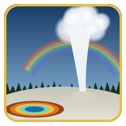

Das Upper Geyser Basin im Yellowstone-Nationalpark als 3D-Szene in reinem Java, mit eigenem Software-Renderer. Old Faithful und seine Nachbarn brechen nach einem physikalischen Röhrenmodell aus. Tausende Tropfen fallen auf den Sinter zurück, Dampf steigt auf und fängt die Sonne, und im Sprühnebel steht der Regenbogen dort, wo er hingehört. Die heißen Quellen leuchten in den Farben ihrer Bakterienmatten. Die Ablagerungen am Rand lassen sich bis auf die Atome aufschlüsseln. Die Kamera kreist frei oder fliegt nach Drehbuch.

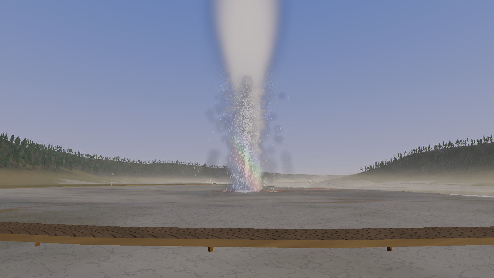

| | |
|---|---|
| 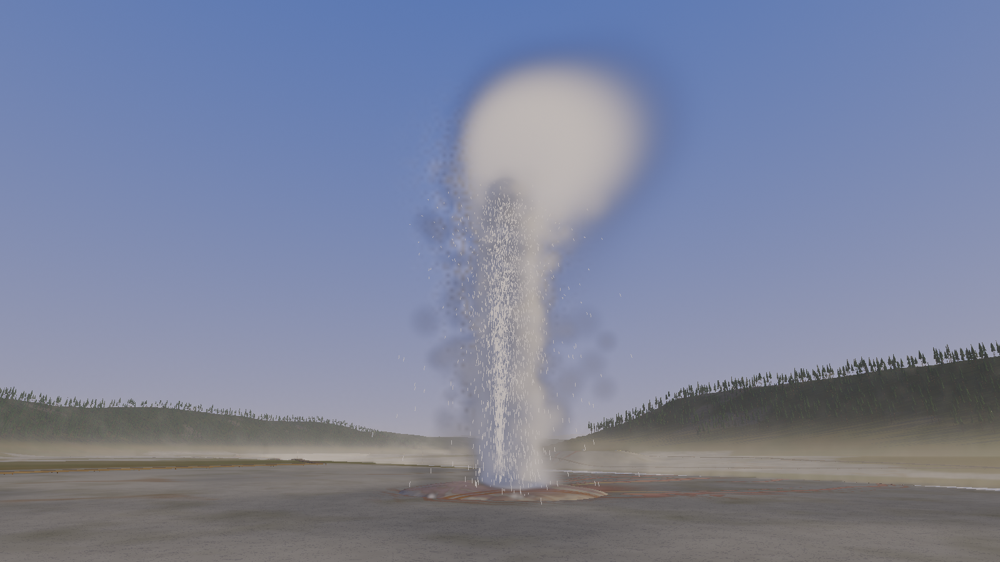 | 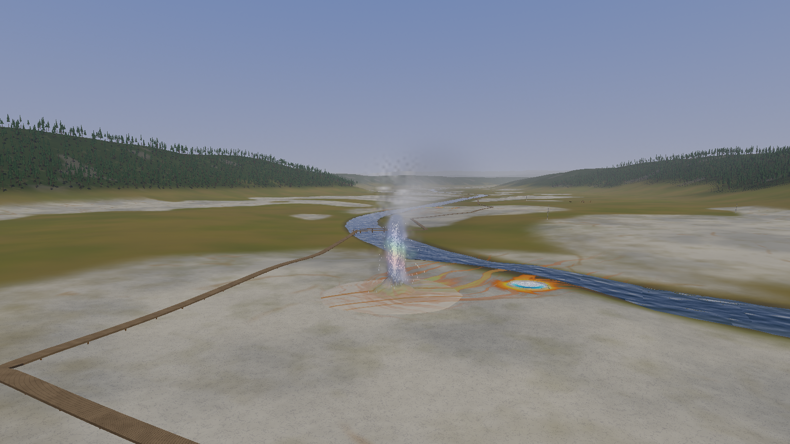 |
| Old Faithful vom Steg | Castle Geyser am Firehole River |
| 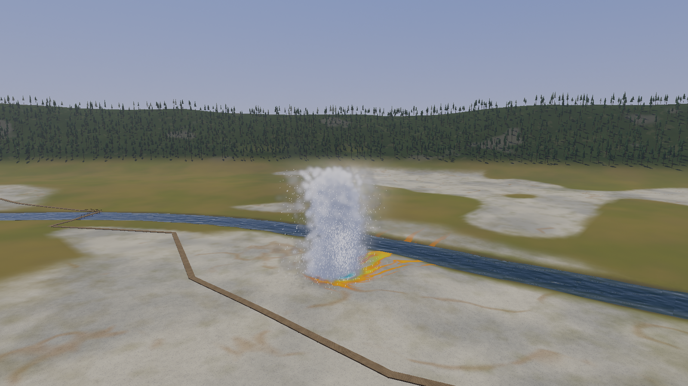 | 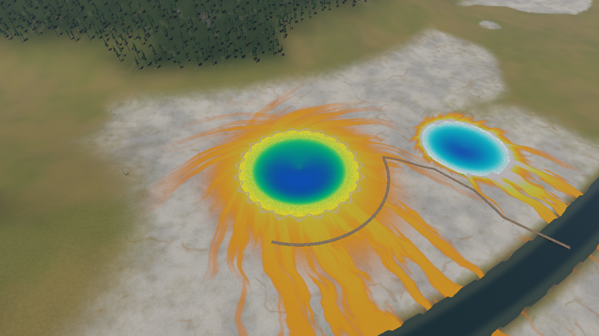 |
| Grand Geyser, ein Fontänengeysir | Grand Prismatic Spring im Midway Geyser Basin |
| 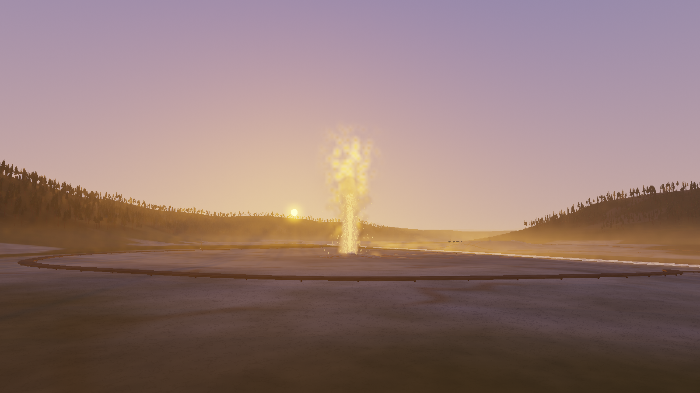 | 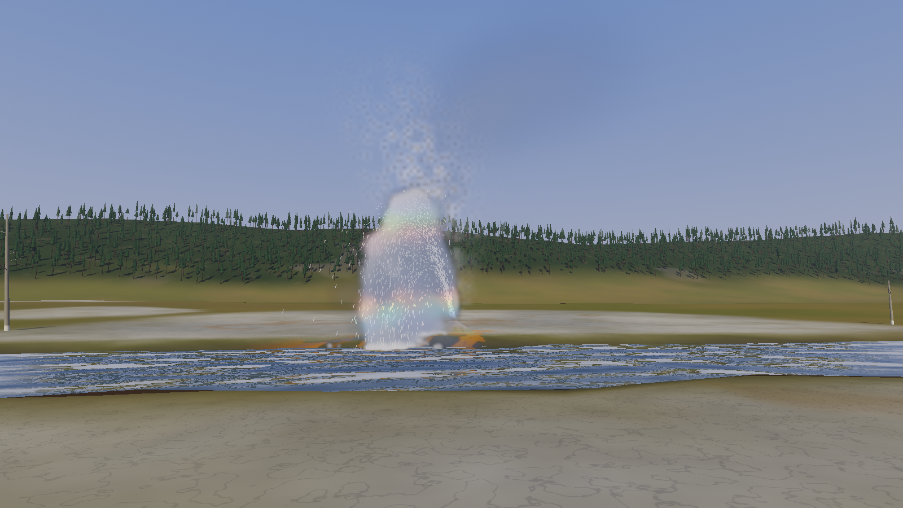 |
| Abends im Gegenlicht | Riverside Geyser, schräg über den Fluss |

## Inhalt

- [Was die Szene kann](#was-die-szene-kann)
- [Zugaben](#zugaben)
- [Wald-Paket](#wald-paket)
- [Datenbank](#datenbank)
- [Bedienung](#bedienung)
- [Bauen und starten](#bauen-und-starten)
- [Technik](#technik)
- [Projektaufbau](#projektaufbau)
- [Zu den Zahlen und Quellen](#zu-den-zahlen-und-quellen)

## Was die Szene kann

**Geysire.** Old Faithful, Beehive, Castle, Grand, Riverside, Daisy, Grotto, Fan, Giantess und ihre Nachbarn rechnen je ein Röhrenmodell. Das Wasser am Grund siedet erst beim Druck der Säule darüber. Schwappt im Vorspiel Wasser über, sinkt der Druck, das Wasser darunter verdampft schlagartig, und die Säule schießt heraus. Höhe, Dauer und Abstand liegen in den belegten Bereichen, bei Old Faithful 30 bis 55 m. Eine Tafel sagt den nächsten Ausbruch voraus wie die Ranger im Visitor Center: 65 Minuten nach Ausbrüchen unter 2½ Minuten, sonst 91.

**Gekoppelte Geysire.** Unter der Erde hängen die Röhren zusammen:

- Grand bricht ein bis zwei Minuten nach dem Beginn eines Ausbruchs von Turban aus, der vorher alle 15 bis 25 Minuten spielt. Während Grand spielt Turban ununterbrochen.
- Beehive's Indicator, 3 m neben Beehive, spritzt im Mittel gut 13 Minuten vor Beehive.
- Fan und Mortar brechen gemeinsam aus.
- Splendid schläft seit 1998. Bricht er aus (von Hand), verschiebt er Daisy.
- Während der seltenen, stundenlangen Ausbrüche von Giantess wallt Doublet Pool.

Grotto hat normale Ausbrüche von ein bis zwei Stunden und nach einigen davon einen Marathon bis 26 Stunden.

**Becken.** Drei Orte liegen nach ihren Koordinaten im Gelände:

- Upper Geyser Basin mit Geyser Hill, Castle, Grand, Riverside, der Daisy-Gruppe, Grotto, Fan und Mortar und Morning Glory Pool
- Midway Geyser Basin mit Grand Prismatic Spring, dem Krater von Excelsior und dem Aussichtspunkt am Hang
- Lower Geyser Basin mit den Schlammtöpfen am Fountain Paint Pot: grau-rosa Ton, in dem Blasen wachsen, platzen und Batzen werfen

Dazu kommen der Firehole River, Stege und Brücken, rund 10 500 Drehkiefern und tote Stämme mit weißen „Bobby Socks“. Die Farben der Quellen folgen einem Temperaturfeld nach den Angaben des NPS: tiefblau in der heißen Mitte, dann gelbgrün, orange, rostrot und braun. Im Sommer leuchten die Matten orange, im Winter werden sie olivgrün.

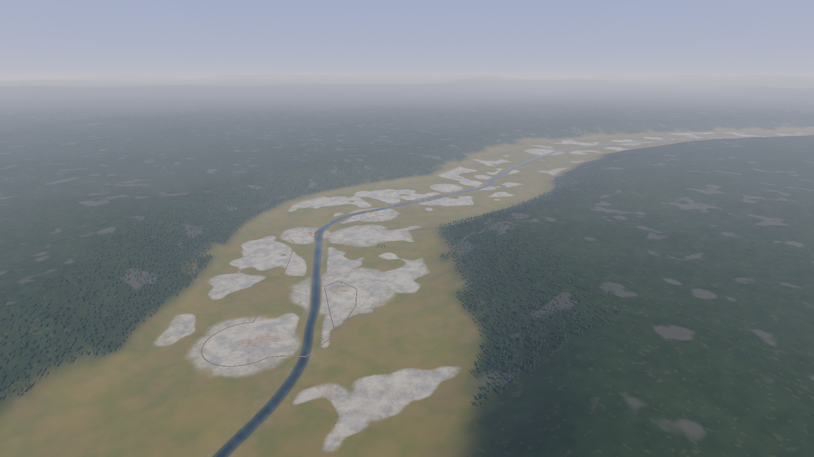

**Wasser und Dampf.** Tropfen, Gischt, Dampf und Spritzer fliegen mit Luftwiderstand im Wind. Sie landen, nässen den Sinter und laufen bergab ab. Wie viel Dampf man sieht, hängt an der Luft. Grundlage sind die Klimanormalwerte 1991–2020 der Station Old Faithful. An einem kalten Wintermorgen verschwindet das Becken in Wolken, am Sommermittag ist es fast klar. Dampfwolken werfen Schatten in sich selbst.

**Licht.** Sonne und Mond stehen zu jedem Tag und jeder Uhrzeit richtig über 44,46° N, 110,83° W. Dazu gibt es:

- zwei Schattenkarten, eine feine über dem Ort und eine weite über Tal und Plateau
- Lichtstrahlen im Dampf und im Morgennebel
- den Regenbogen bei 42° um den Gegenpunkt der Sonne, mit Nebenbogen, nur wo Tropfen in der Luft sind
- nachts den Mondregenbogen bei Vollmond
- die hellen Sterne an ihren Örtern für 2026 und die Milchstraße mit dem Großen Riss
- Schnee, der über warmem Boden taut, und Raureif an den Bäumen nahe den Quellen

**Regie.** Elf Blickpunkte, vier Kamerafahrten, ein Rundgang auf den Stegen und das Drehbuch „Ein Tag am Old Faithful“: vom Morgengrauen über den Regenbogen im Vormittagslicht, Castle, Grand und Grand Prismatic bis zur Nacht unter der Milchstraße, mit Tafeln und Quellen.

| | | |
|---|---|---|
| 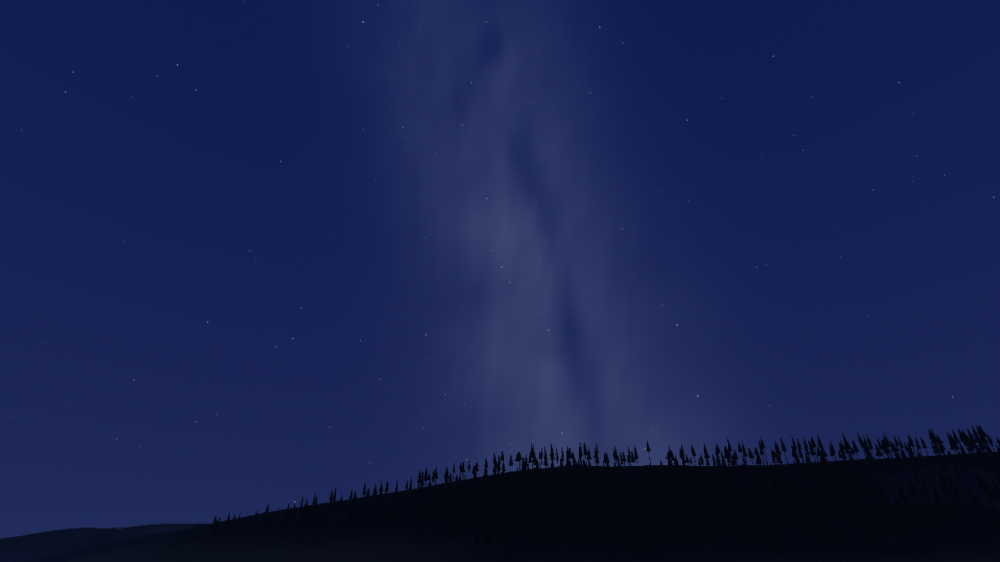 | 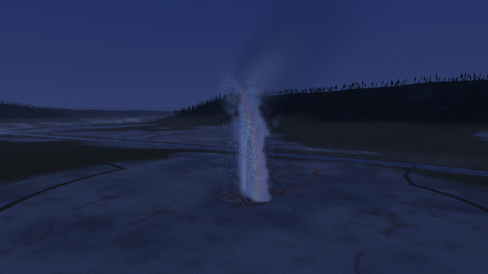 | 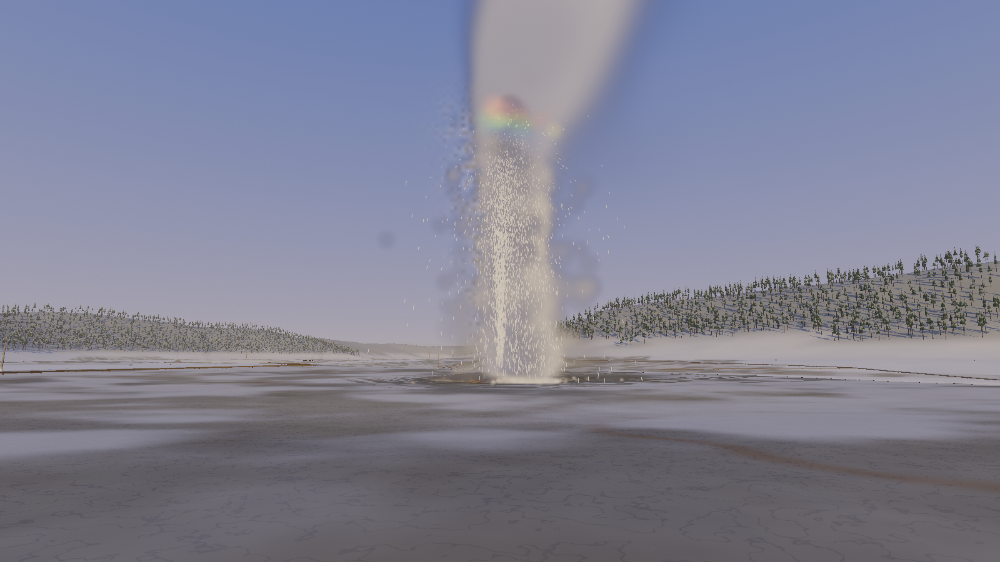 |
| Milchstraße mit dem Großen Riss | Mondregenbogen bei Vollmond | Januar: Schnee, Dampf, Raureif |
| 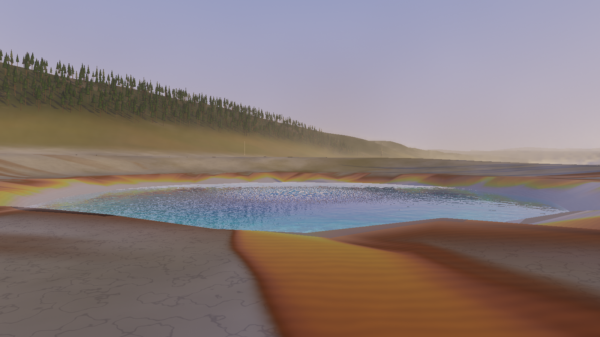 | 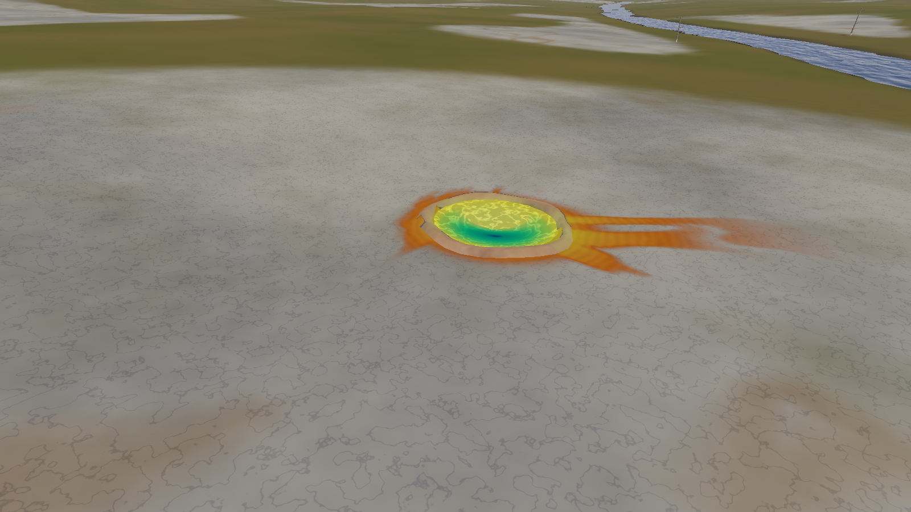 | 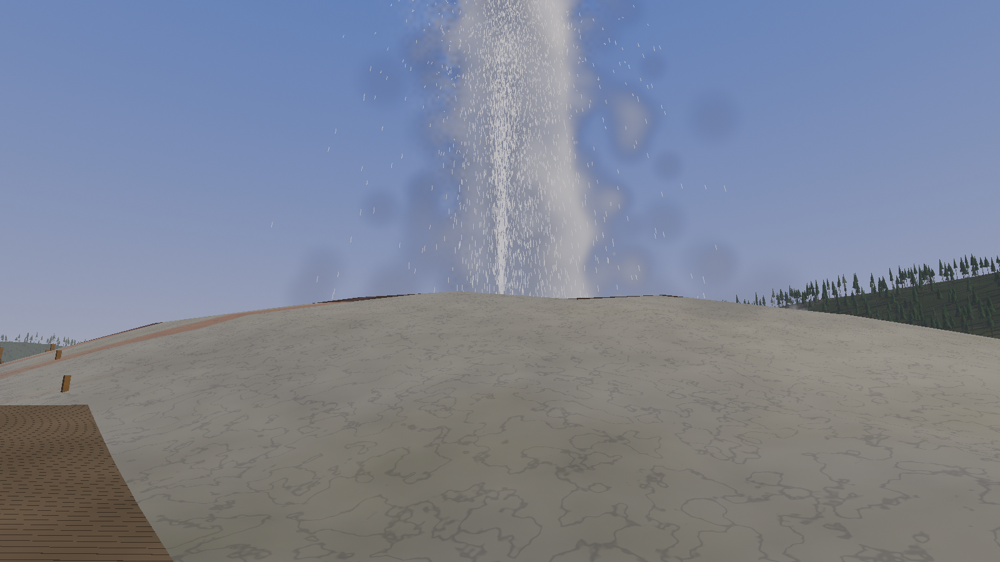 |
| Excelsior, zuletzt 1985 ausgebrochen | Morning Glory Pool | Beehive auf Geyser Hill |
| 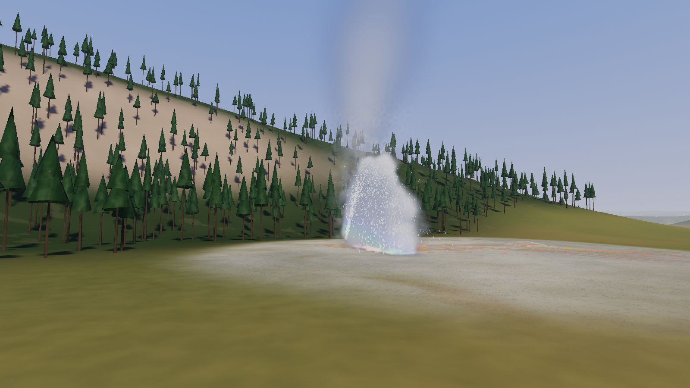 | 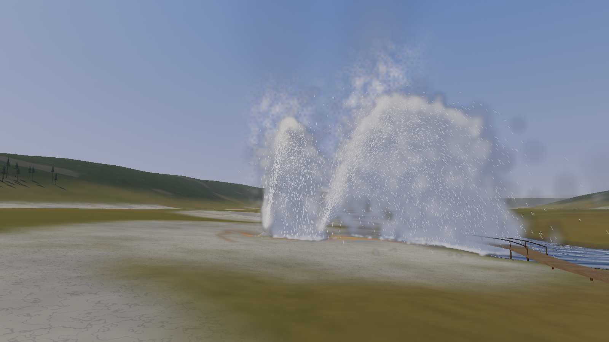 | 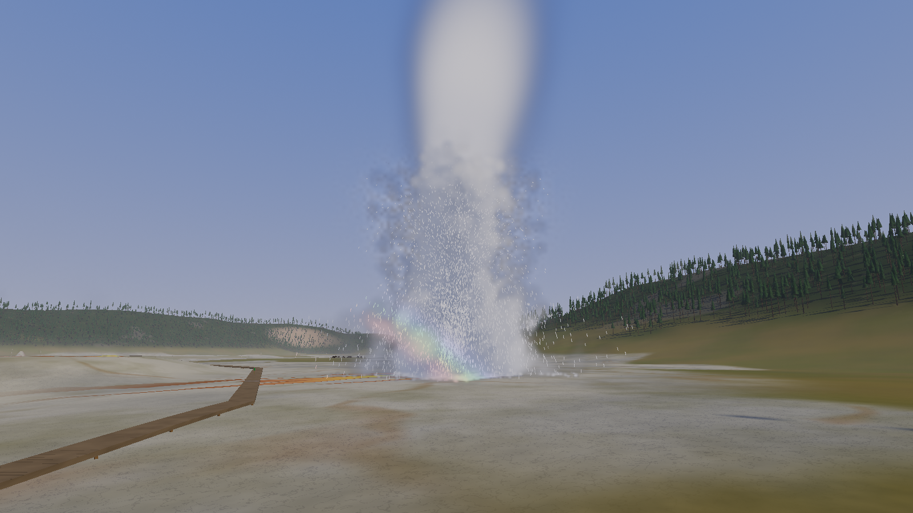 |
| Daisy, schräg auf ihrer Sinterterrasse | Fan und Mortar am Firehole | Giantess auf Geyser Hill |

## Zugaben

**Mineral-Lupe.** Ein Klick mit Strg (oder U) auf den Rand einer Quelle zeigt, woraus die Ablagerung besteht: Kieselsinter, Travertin, Schwefel, Eisen(III)-oxid, Skorodit und Alunit. Jedes beteiligte Element dreht sich als Atom aus dem `FAtomView` des ATOMMODEL. Die Elementdaten kommen aus der View `am_element`, ohne Datenbank aus eingebauten Werten.

**Sinter-Zeitraffer.** An Castle Geyser wachsen Terrasse und Kegel von 7100 Jahren vor heute bis 2026, der Kegel ab dem Jahr 1022.

**Schnitt durch die Röhre.** Ein Schnitt zeigt Kegel, Röhre und Wassersäule mit der Temperatur als Farbe und Blasen, wo das Wasser siedet. Daneben stehen Siedepunkt (nach der Antoine-Gleichung) und Wassertemperatur über der Tiefe. Man sieht, wie der Ausbruch unten beginnt, bevor oben etwas passiert.

**Wärmebild.** Eine Skala von −30 bis 100 °C zeigt Quellen, Abflüsse, sonnenwarmen Sinter und abkühlenden Dampf.

**Klang.** Das Tosen der Säule, das Zischen der Dampfphase, Blasen in den Quellen, der Firehole und der Wind werden laufend erzeugt, in Stereo und ohne Tondateien. Von Anfang September bis Mitte Oktober röhren die Wapitibullen, im Juli und August brüllen die Bisons.

**Tiere.** Bisonherden und Wapitirudel ziehen je nach Jahreszeit über die Wiesen. Im Winter stehen sie auf warmem Boden an den Quellen. Kälber laufen von Mai bis in den Oktober mit, Geweihe tragen die Bullen von Ende Juli bis Ende Februar.

| | | |
|---|---|---|
| 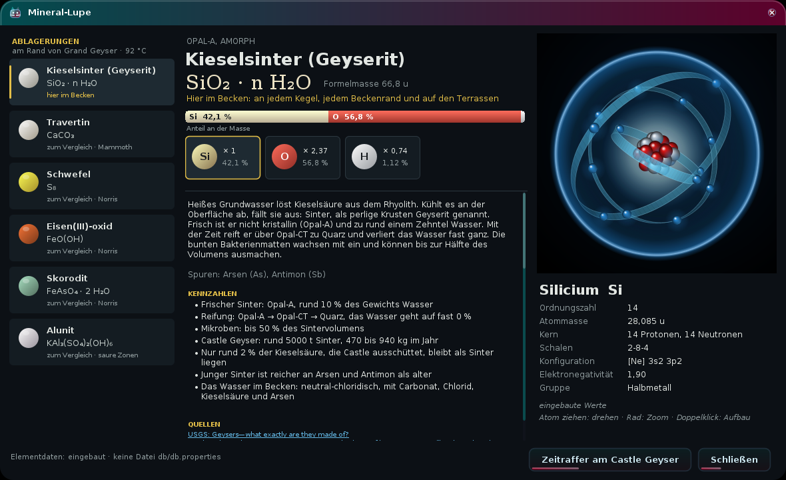 | 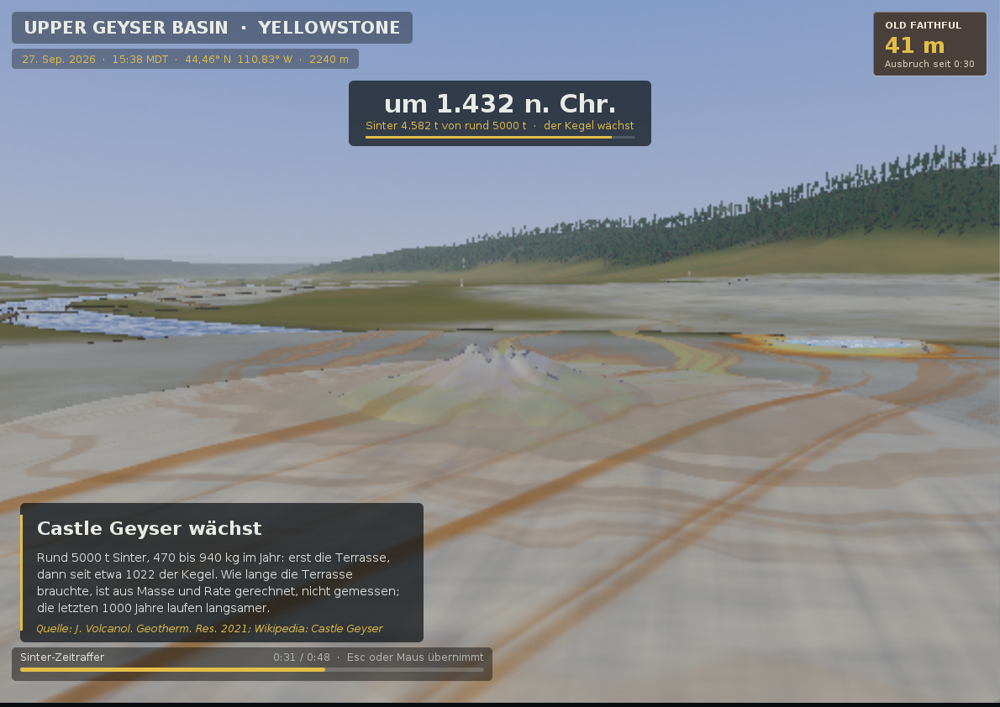 | 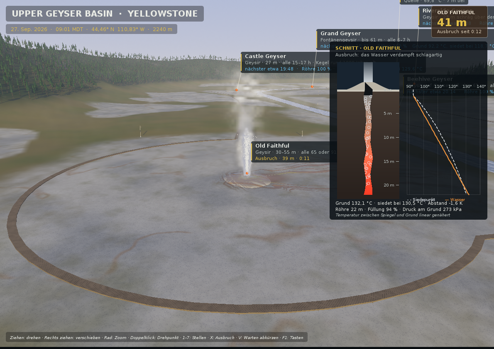 |
| Mineral-Lupe | Sinter-Zeitraffer | Schnitt durch die Röhre |
| 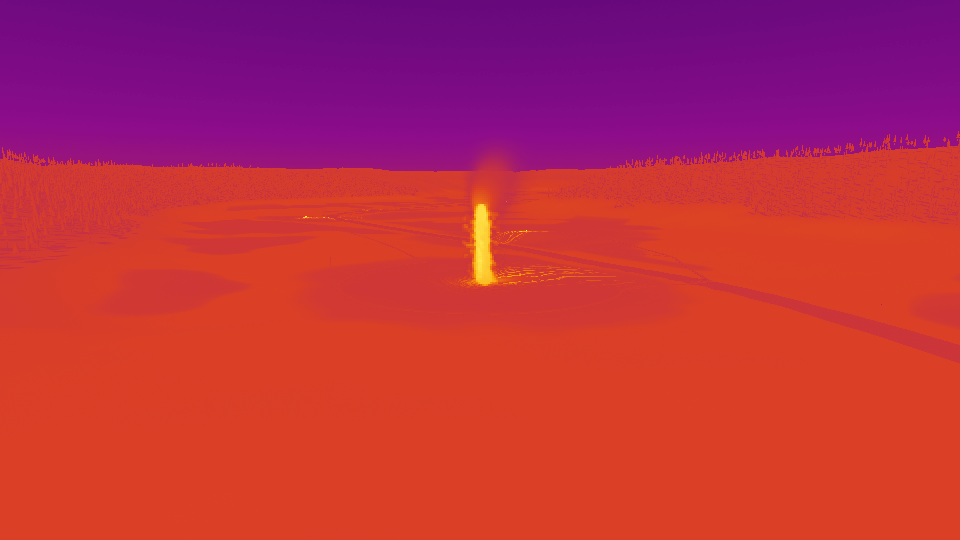 | 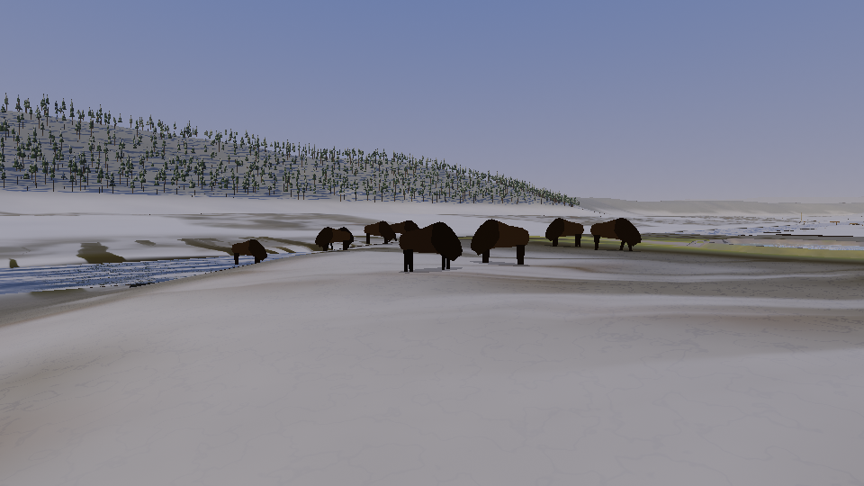 | 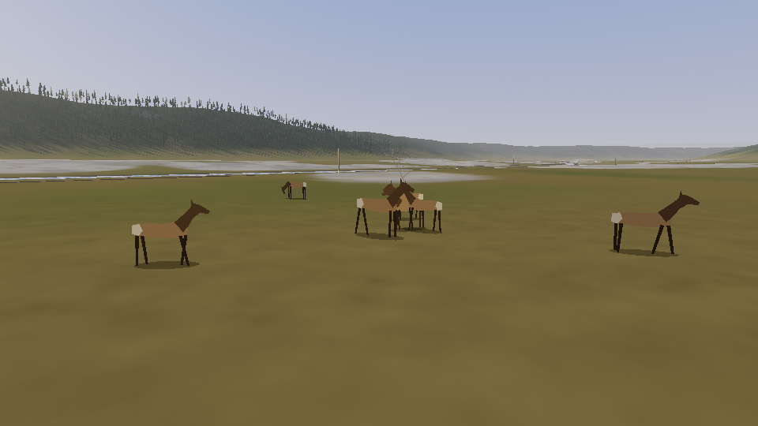 |
| Wärmebild | Bisons im Winter | Wapitis |

**Grundwasser.** Ein Regler bestimmt, wie viel Regen und Schnee der letzten Jahre im Boden steckt. In Dürrejahren werden die Abstände länger. Bei Old Faithful waren es 1997 im Mittel 71 und 2006 91 Minuten (Hurwitz u. a. 2008). Unter rund 40 % füllt sich die Röhre nicht mehr bis zum Rand, und er verstummt, wie in der Dürre des 13. Jahrhunderts (Hurwitz u. a. 2020). Die Tafel rechnet weiter mit der Regel von heute und liegt dann daneben.

**Vorboten.** Vor einem Ausbruch fallen Dampfblasen in kälterem Wasser zusammen. Der Tremor wächst in den letzten rund 45 Minuten, ist im Vorspiel am stärksten und bricht mit dem Ausbruch ab (Kedar u. a. 1998, Wu u. a. 2019). Unter dem Röhrenschnitt läuft ein Seismogramm mit. Im Klang wird der Tremor als dumpfe Schläge und Grollen hörbar, die Tafel meldet „der Boden zittert“.

**Morning Glory im Zeitraffer.** Von 1883 bis heute: erst heiß und tiefblau, dann verstopfen Münzen und Abfall den Schlot, die Quelle kühlt ab, und gelbe und orange Matten wachsen zur Mitte. Dazu die Reinigungen 1950, 1975 und 1991. Belegt sind die Eckpunkte, die Temperaturen dazwischen sind ein Modell.

| | | |
|---|---|---|
| 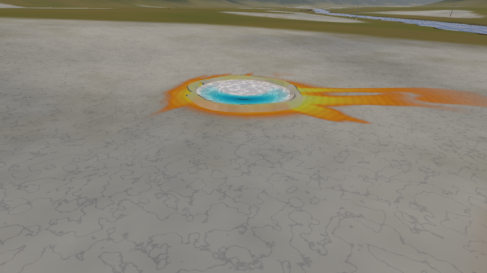 | 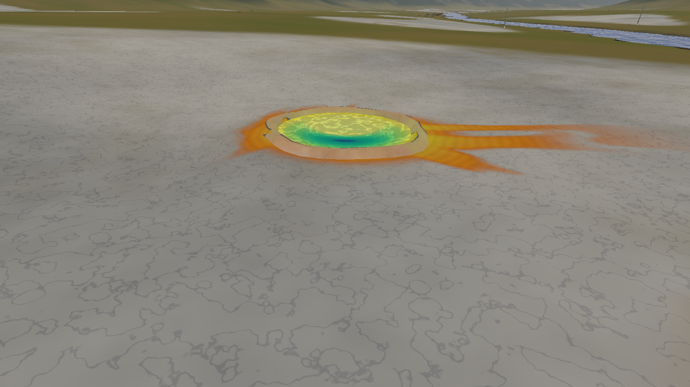 | 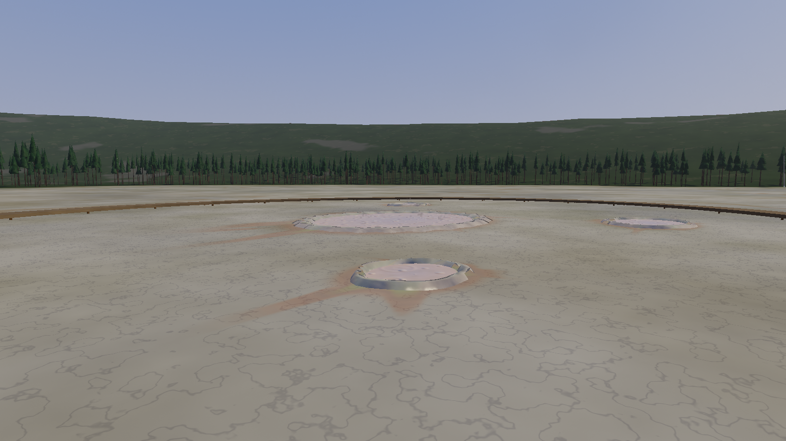 |
| Morning Glory 1910 | Morning Glory 2026 | Schlammtöpfe am Fountain Paint Pot |

**Wetter.** Nach Jahreszeit oder von Hand: klar, bewölkt, Regen, Gewitter, Schneefall. Im Juli und August kommt an etwa jedem dritten Tag nachmittags ein Gewitter, im Winter Schnee. Welcher Tag welches Wetter hat, ist ein Modell. Die Wolkendecke dämpft die Sonne, Regen macht den Boden nass, Blitze hellen die Szene auf, und der Donner kommt mit rund 3 s je km Verspätung.

**Besucher.** Vor der vorhergesagten Zeit sammeln sich Menschen am Halbrund um Old Faithful, nach dem Ausbruch gehen die meisten. Im Juli stehen dort bis über 1000, im Winter wenige, bei Regen weniger. Gezeigt werden höchstens 240 Figuren.

**Rätsel „Wann bricht er aus?“.** Nach einem Ausbruch von Old Faithful tippt man den nächsten, die Tafel der Ranger ist so lange verdeckt. Beim Ausbruch zeigt die App, wie weit der Tipp und wie weit die Regel danebenlagen, und führt eine Bilanz.

| | |
|---|---|
| 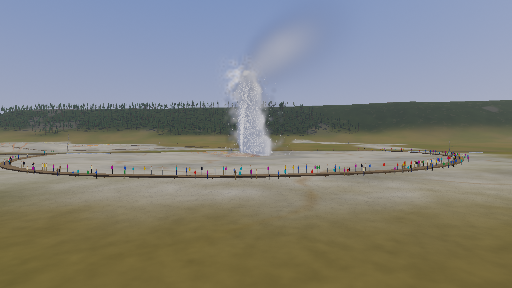 | 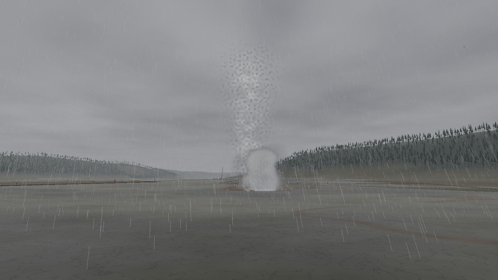 |
| Besucher am Halbrund | Gewitter am Nachmittag |

**Farbstile.** Unter BILD gibt es sechs Farbstile: Natürlich, Neutral, Kodachrome, Abendgold, Winterblau und Schwarzweiß mit Gelbfilter nach Ansel Adams' Aufnahme von Old Faithful aus dem Mural Project 1941–42.

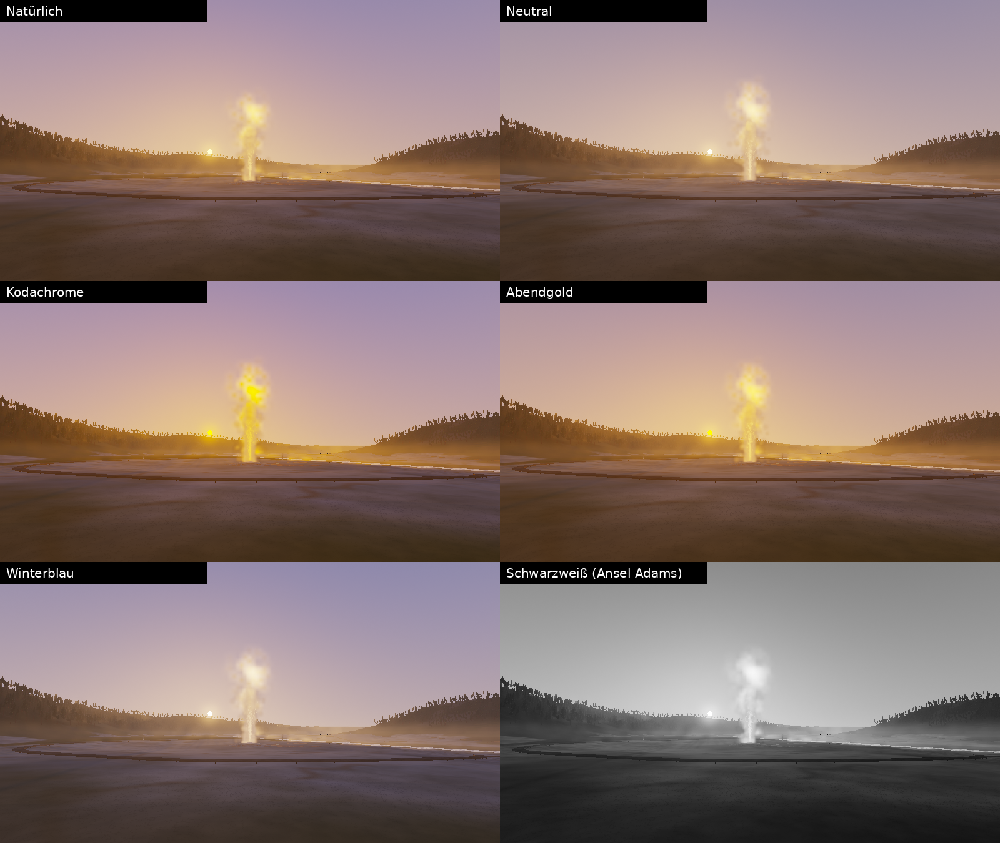

## Wald-Paket

`src/com/dan/forest/` ist ein eigenes Paket für Bäume und Wald. Es ist unabhängig von Geyser und lässt sich herauskopieren. Die Bäume wachsen prozedural und kommen in sieben Arten:

- Yellowstone: Drehkiefer, Espe, Douglasie
- Mitteleuropa: Eiche, Buche, Birke, Fichte

Stamm, Äste und Blätter bewegen sich getrennt im böigen Wind. Mit der Jahreszeit treiben die Bäume aus, färben sich und werfen ihr Laub ab, die Blätter trudeln zu Boden. Ferne Bäume werden in vier Stufen vereinfacht. Die Kiefern im Becken stammen jetzt aus diesem Paket. Einzelheiten zur Benutzung stehen in [`src/com/dan/forest/README.md`](src/com/dan/forest/README.md). Zum Ausprobieren startet man `com.dan.forest.demo.ForestDemo`.

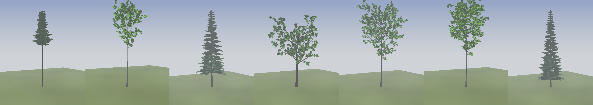

| | |
|---|---|
| 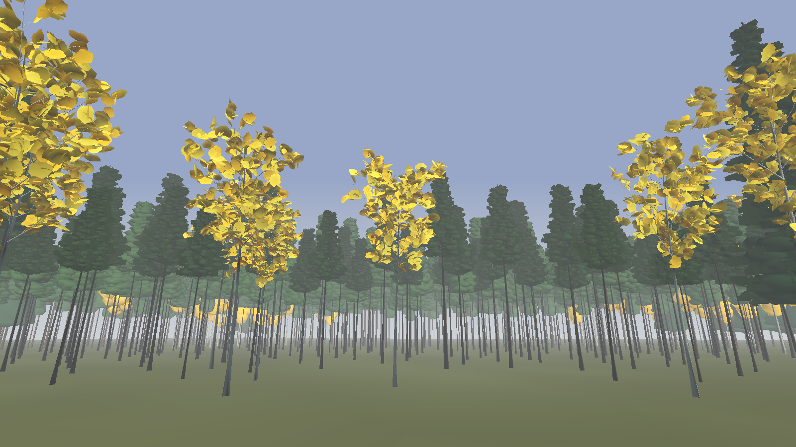 | 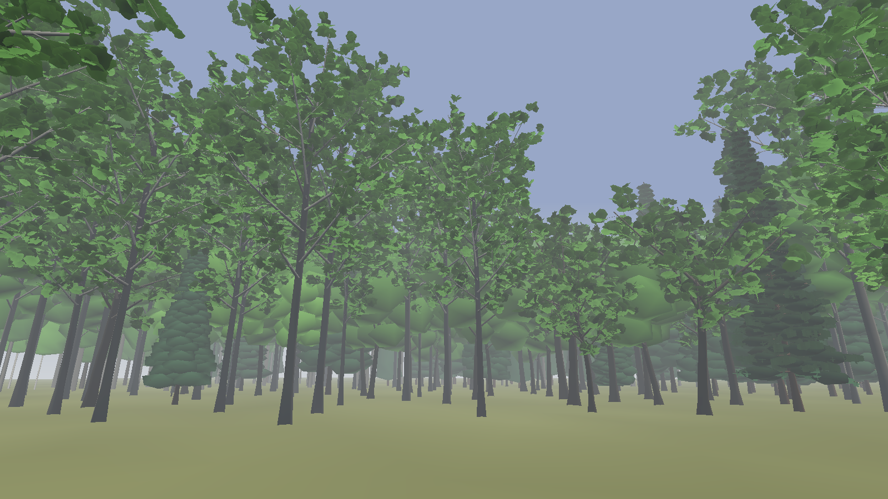 |
| Yellowstone im Herbst: Espen zwischen Drehkiefern | Mischwald in Mitteleuropa im Sommer |
| 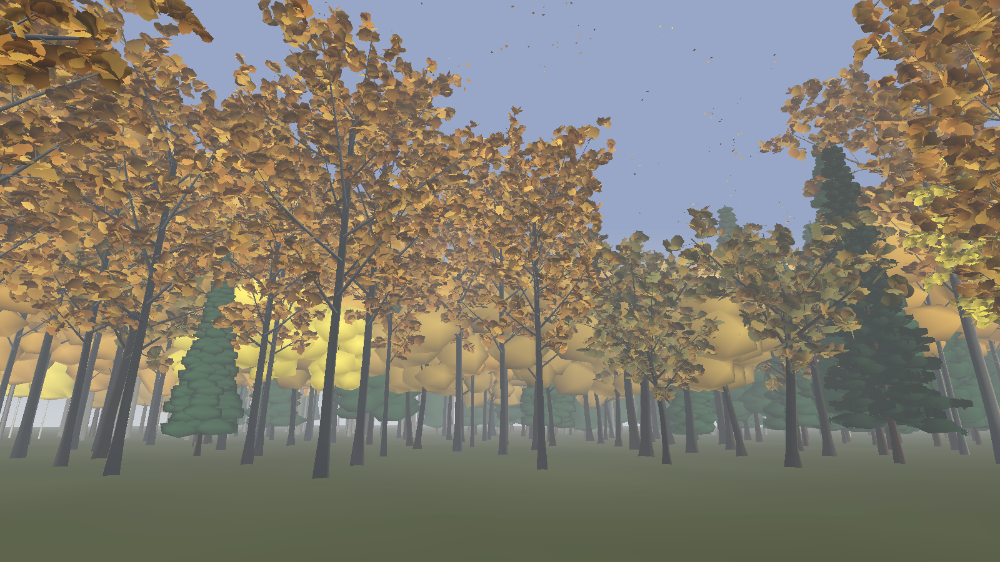 | 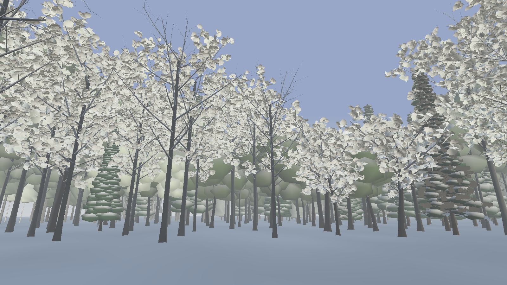 |
| Herbst mit fallendem Laub | Winter mit Schnee |

## Datenbank

Die App läuft auch ohne Datenbank. Mit Oracle (getestet mit 21c, Schema DEMO, Präfix `GEY_`) kommt mehr dazu:

- **Stammdaten:** Tafeln, Kennwerte der Röhrenmodelle, Mineralien und Klima kommen aus den Tabellen.
- **Belege:** 24 Quellen und 40 Kennzahlen, jede Zahl mit ihrer Quelle.
- **Orte:** die zwölf Stellen als `SDO_GEOMETRY` in SRID 8307 mit Spatial-Index.
- **Protokoll:** Jede Sitzung und jeder Ausbruch wird mit Vorhersage und Abweichung gespeichert. Die Auswertung über alle Sitzungen steht in der View `GEY_PREDICTION_V`.
- **Zustände:** Der Zustand beim Beenden wird gespeichert. Dazu kommen benannte Zustände zum Laden.

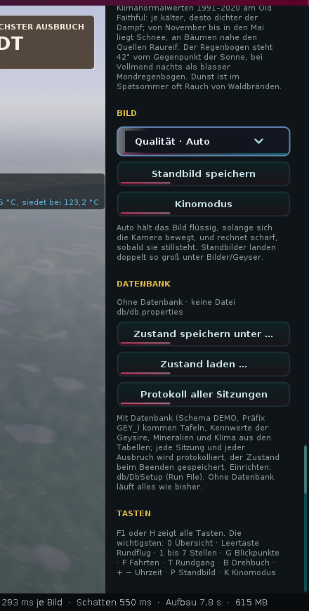

**Einrichten:**

1. `db/db.properties` anlegen:
   ```properties
   url=jdbc:oracle:thin:@//localhost:1521/PDBORCL
   user=DEMO
   password=…
   ```
2. In NetBeans `src/com/dan/geyser/db/DbSetup.java` mit „Run File“ ausführen. Er führt `db/sql/01_tabellen.sql` bis `04_api.sql` aus. Danach prüft er alles bis zum Durchstich (Schreiben, Lesen, Aufräumen) und schreibt das Protokoll nach `db/einrichtung.txt`.
3. Mit dem Argument `neu` baut `DbSetup` vorher alles mit `GEY_` ab, mit `pruefen` prüft er nur, mit `abbau` entfernt er alles.

Die Skripte laufen auch in SQL*Plus oder SQL Developer. Mehr steht in `db/LIESMICH.txt`.

Eine Datenbank, die vor den neuen Stellen und dem Lower Geyser Basin eingerichtet wurde, kennt diese noch nicht. Die App schreibt deren Ausbrüche dann nicht mit. `DbSetup neu` richtet alles neu ein.

## Bedienung

| Taste | Wirkung |
|---|---|
| Maus ziehen, rechts ziehen, Rad | drehen, verschieben, Zoom |
| Doppelklick | neuer Drehpunkt |
| W A S D oder Pfeile, Q E, Umschalt | Drehpunkt bewegen, tiefer und höher, schneller |
| 0 oder R, Leertaste | Übersicht, Rundflug |
| 1 bis 6, 7, M | Old Faithful bis Morning Glory, Grand Prismatic, Ort wechseln (Upper, Midway, Lower) |
| G, F, T, B | nächster Blickpunkt, Kamerafahrt, Rundgang, Drehbuch |
| Esc oder Maus | Kamera übernehmen |
| X, V | nächsten Geysir auslösen, Warten abkürzen (60-fach) |
| F2 | Rätsel: Wann bricht er aus? |
| + und − | eine halbe Stunde vor oder zurück |
| U oder Strg+Klick, Z, J | Mineral-Lupe, Sinter-Zeitraffer, Morning Glory im Zeitraffer |
| C, I, O, N, F3 | Schnitt mit Seismometer, Wärmebild, Klang, Bisons und Wapitis, Besucher |
| Y | Wetter wechseln |
| L | Beschriftung |
| P | Standbild in doppelter Auflösung nach `Bilder/Geyser` |
| K oder F11 | Kinomodus |
| F1 oder H | alle Tasten |

| | |
|---|---|
| 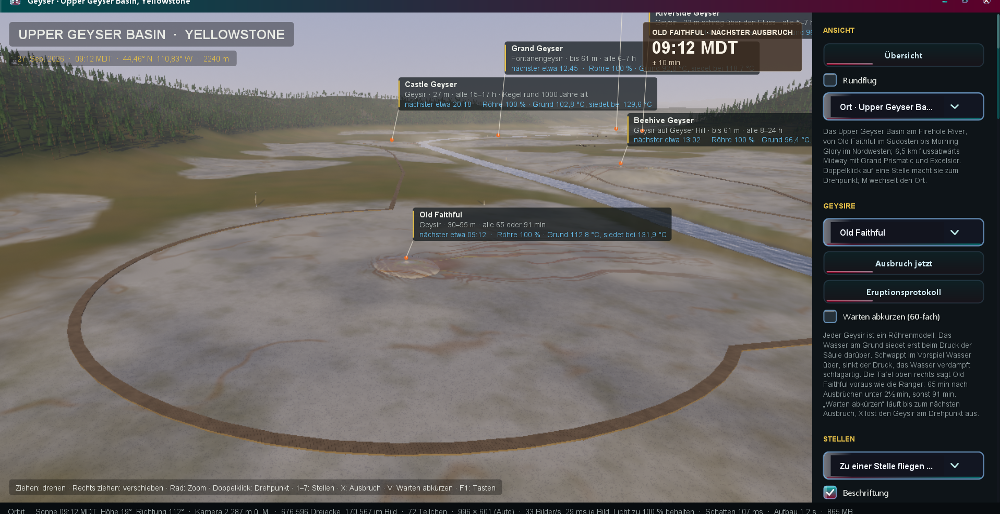 | 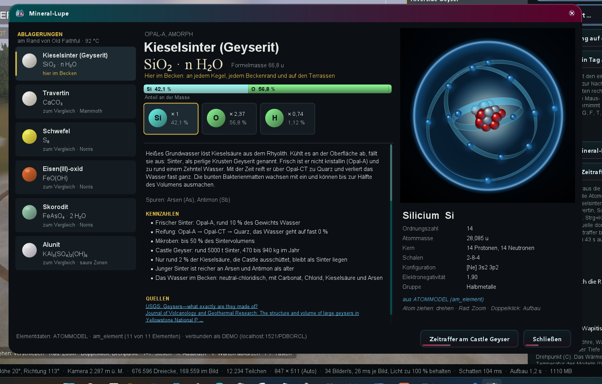 |
| Die App mit Bedienfeld | Mineral-Lupe in der App |

## Bauen und starten

- **Werkzeuge:** JDK 21 und NetBeans (Ant). Das Projekt öffnen und starten. Die Hauptklasse ist `com.dan.geyser.GeyserApp`. Außerhalb von NetBeans startet `Geyser.bat` das Jar aus `dist/`.
- **Bibliotheken in `lib/`:**
  - `FStyle.jar`: Oberfläche aus `com.dan.*` mit FFrame, FButton, FComboBox, FDialog, FTable und FScrollBar
  - `ATOMMODEL.jar`: `FAtomView` für die Mineral-Lupe
  - `ojdbc11.jar`: nur für die Datenbank
- **Speicher:** Die App braucht 4 GB (`-Xmx4g`, steht in den Projekteinstellungen).
- **Symbol:** Das Programmsymbol wird im Code gemalt (`ui/AppIcon`). Als Datei liegt es als `geyser.ico` und `geyser_256.png` bei, etwa für eine Verknüpfung.

**Werkzeuge:**

| Klasse | Zweck |
|---|---|
| `tools.StillRender` | Standbilder ohne Fenster, auch einzelne Einstellungen des Drehbuchs, mit Wetter und dem Jahr für Morning Glory; damit sind die Bilder dieser Seite gemacht |
| `tools.FilmRender` | das Drehbuch als Film ohne Fenster: PNG-Folge mit Tafeln und Blenden, Tonspur als WAV, dazu der ffmpeg-Aufruf für ein MP4 |
| `tools.DbBestand` | Bestandsaufnahme im Schema, nur lesend |
| `db.DbSetup` | richtet die Datenbank ein und prüft sie |
| `db.Inhalte` | erzeugt `db/sql/03_inhalte.sql` aus den Daten im Code |

## Technik

Es gibt keine GPU-Shader und keine 3D-Bibliothek. Alles läuft als Java-Code auf dem Prozessor, parallel in Streifen:

- **Rasterung:** in einen G-Puffer mit Tiefe, Normale, Material und Himmelssicht; Sichtprüfung je Block.
- **Beleuchtung je Pixel:** zwei Schattenkarten mit weichen Rändern, Himmelslicht, Glanz, prozedurale Materialien ohne Bilddateien.
- **Heiße Quellen:** ein Temperaturfeld je Quelle mit Abflussrinnen. Es wird in Kacheln von 8 × 8 m mit 25 cm Raster vorgehalten, erst wenn sie ins Bild kommen.
- **Teilchen:** Tropfen und Dampf in halber Auflösung, tiefenbewusst ins volle Bild. Ein Hash-Gitter liefert den Selbstschatten der Wolken. Der Regenbogen wird je Tropfen aus dem Winkel zur Sonne berechnet.
- **Volumetrik:** Strahlengang in Sechstelauflösung mit Henyey-Greenstein-Phase, Bodennebel und Dampf über dem Fluss.
- **Nachbearbeitung:** Bloom, Belichtungsautomatik, ACES-Filmkurve, Farbstil.
- **Klang:** synthetisch in Stereo, ohne Tondateien.
- **Qualität Auto:** hält 30 Bilder/s. In Bewegung rechnet sie ein kleineres Bild. Steht die Kamera, übernimmt der Bildrechner Bodenfarbe, Sonnenanteil, Himmel und Dunst aus dem vorigen Bild. Neu gerechnet wird nur, was sich bewegt: Dampf, Wasser, Bäume im Wind. Der Kinomodus rechnet nur das Breitbild-Band.

**Gemessen** mit 1246 × 752 Bildpunkten nah an einem Ausbruch von Old Faithful, 14 000 Teilchen, auf 2 Kernen:

| | vorher | nachher |
|---|---|---|
| Kamera in Bewegung | 422 ms | 338 ms |
| Kamera steht | 422 ms | 165 ms |

## Projektaufbau

```
src/com/dan/geyser/
  GeyserApp.java    Einstieg, FFrame
  core/             Renderer, Gelände, Temperaturfeld, Materialien, Schatten, Tiere
  effects/          Himmel, Sonne und Mond, Sterne, Klima, Wetter, Teilchen, Klang
  world/            Becken, Geysire und Röhrenmodell, Kopplungen, Stellen, Wege, Tiere, Besucher, Morning Glory
  camera/           Kamerasteuerung, Pfade, Blickpunkte, Regie
  atom/             Mineral-Lupe, Mineralien, Elemente, Sinter-Zeitraffer
  db/               Datenbankzugriff, Belege, Einrichter
  ui/               Szene, Bedienfeld, Dialoge, Röhrenschnitt, Programmsymbol
  tools/            Werkzeuge (siehe oben)
src/com/dan/forest/ Wald-Paket: Arten, Baumerzeuger, Wind, Jahreszeit, Laubfall, Demo
db/sql/             SQL-Skripte 01 bis 04 und 99_abbau
docs/bilder/readme/ Bilder dieser Seite
docs/bilder/app/    Bildschirmfotos der App
docs/bilder/wald/   Bilder zum Wald-Paket
docs/bilder/phase*/ Prüfbilder aus der Entwicklung, nach Phasen
```

## Zu den Zahlen und Quellen

**Belegt** sind Lage und Höhe der Stellen, die Kennwerte der Ausbrüche, die Farben der Matten nach Temperatur, die Klimanormalwerte, die Zusammensetzung der Ablagerungen und die Angaben zu Bison und Wapiti. Jede Zahl steht mit Quelle in der Datenbank (`GEY_SOURCE`, `GEY_FACT`). **Modell** sind der Verlauf eines einzelnen Ausbruchs, die Form der Abflussrinnen, das Gelände zwischen den Stellen (am Daisy und im Lower Geyser Basin an den Talboden angeglichen), die Temperaturen von Morning Glory zwischen den Eckpunkten, welcher Tag welches Wetter hat, wie viele Besucher kommen und wie stark das Grundwasser die Abstände verlängert. Sie folgen den Kennwerten, zeigen aber nicht jeden Stein.

- [NPS: Old Faithful Geyser](https://home.nps.gov/articles/old-faithful-geyser.htm)
- [NPS: Upper Geyser Basin](https://www.nps.gov/features/yell/ofvec/exhibits/treasures/ugb/index.htm)
- [NPS: Grand Prismatic Spring](https://www.nps.gov/places/000/grand-prismatic-spring.htm)
- [NPS: Thermophilic Communities](https://www.nps.gov/yell/learn/nature/thermophilic-communities.htm) und [Bakterien am Fountain Paint Pot](https://www.nps.gov/features/yell/tours/fountainpaint/bacteria.htm)
- [NPS: Bison](https://www.nps.gov/yell/learn/nature/bison.htm), [Elk](https://www.nps.gov/yell/learn/nature/elk.htm), [Safety](https://www.nps.gov/yell/planyourvisit/safety.htm)
- Wikipedia: [Old Faithful](https://en.wikipedia.org/wiki/Old_Faithful), [Castle Geyser](https://en.wikipedia.org/wiki/Castle_Geyser), [Grand Geyser](https://en.wikipedia.org/wiki/Grand_Geyser), [Beehive Geyser](https://en.wikipedia.org/wiki/Beehive_Geyser), [Riverside Geyser](https://en.wikipedia.org/wiki/Riverside_Geyser), [Morning Glory Pool](https://en.wikipedia.org/wiki/Morning_Glory_Pool), [Grand Prismatic Spring](https://en.wikipedia.org/wiki/Grand_Prismatic_Spring), [Excelsior Geyser](https://en.wikipedia.org/wiki/Excelsior_Geyser), [Rainbow](https://en.wikipedia.org/wiki/Rainbow)
- [Current Results: Yellowstone-Temperaturen nach Monat](https://www.currentresults.com/Weather/Wyoming/Places/yellowstone-park-temperatures-by-month-average.php) (NOAA-Normalwerte 1991–2020)
- USGS: [Geysers—what exactly are they made of?](https://www.usgs.gov/news/geysers-what-exactly-are-they-made), [Travertine](https://usgs.gov/observatories/yvo/news/travertine-yellowstones-hydrothermal-timekeeper), [Alterations go hydrothermal](https://www.usgs.gov/news/alterations-go-hydrothermal-alteration-yellowstone), [The diverse chemistry of Yellowstone's hydrothermal features](https://www.usgs.gov/observatories/yvo/news/diverse-chemistry-yellowstones-hydrothermal-features)
- [J. Volcanol. Geotherm. Res. 2021: The structure and volume of large geysers in Yellowstone](https://www.sciencedirect.com/science/article/abs/pii/S0377027321002201)
- Wikipedia: [Daisy Geyser](https://en.wikipedia.org/wiki/Daisy_Geyser), [Splendid Geyser](https://en.wikipedia.org/wiki/Splendid_Geyser), [Grotto Geyser](https://en.wikipedia.org/wiki/Grotto_Geyser), [Fan and Mortar Geysers](https://en.wikipedia.org/wiki/Fan_and_Mortar_Geysers), [Giantess Geyser](https://en.wikipedia.org/wiki/Giantess_Geyser), [Turban Geyser](https://en.wikipedia.org/wiki/Turban_Geyser), [Doublet Pool](https://en.wikipedia.org/wiki/Doublet_Pool), [Fountain Paint Pot](https://en.wikipedia.org/wiki/Fountain_Paint_Pot)
- [USGS: What's the story, Morning Glory?](https://www.usgs.gov/observatories/yvo/news/whats-story-morning-glory)
- Hurwitz u. a. 2008, Geology: [Klima und Abstände der Geysire](https://www.sciencedaily.com/releases/2008/06/080614080441.htm); Hurwitz u. a. 2020, [Old Faithful in der Dürre des 13. Jahrhunderts](https://agupubs.onlinelibrary.wiley.com/doi/full/10.1029/2020GL089871)
- Kedar u. a. 1998, [Bubble collapse as the source of tremor at Old Faithful](https://agupubs.onlinelibrary.wiley.com/doi/10.1029/98JB01824); Wu u. a. 2019, [Hydrothermal tremor migration](https://agupubs.onlinelibrary.wiley.com/doi/full/10.1029/2018GL081771)
- [Frontiers in Microbiology 2012: Microbial iron cycling in acidic geothermal springs of Yellowstone](https://www.frontiersin.org/journals/microbiology/articles/10.3389/fmicb.2012.00109/full)
- [Library of Congress: Ansel Adams, Old Faithful Geyser, Yellowstone National Park](https://www.loc.gov/item/2021669745) und [National Archives: 79-AA, Ansel Adams Photographs of National Parks and Monuments, 1941–1942](https://unwritten-record.blogs.archives.gov/2021/04/27/79-aa-ansel-adams-photographs-of-national-parks-and-monuments-1941-1942/)
